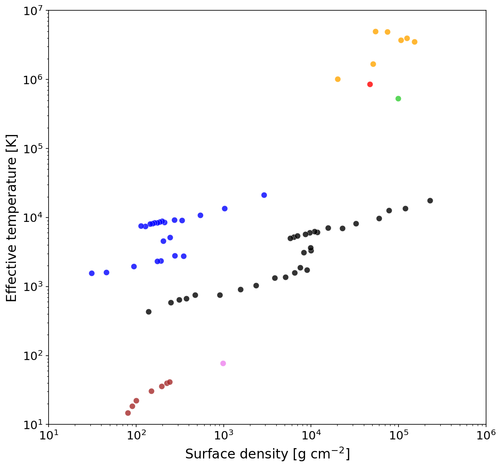
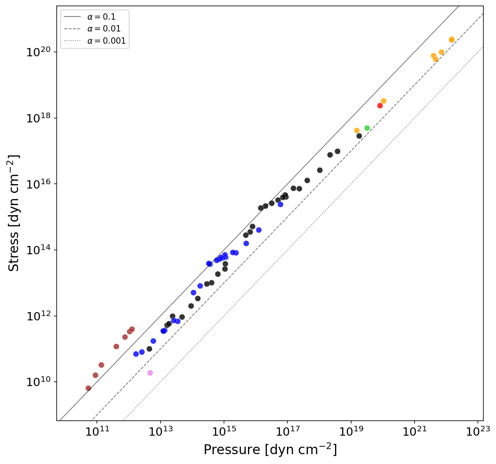

# RMHD_TEs

Thermal Equilibrium states from Radiation MagnetoHydroDynamics simulations of accretion flows.

## Results

<table>
<tr>
<td align="center">
<a href="outputs/TE_curves_all.pdf">

</a>
<br>
<b>Thermal Equilibrium Curves</b><br>
Surface density vs Effective temperature
</td>
<td align="center">
<a href="outputs/alpha_all.pdf">

</a>
<br>
<b>Alpha Parameter Plot</b><br>
Pressure vs Stress (viscosity analysis)
</td>
</tr>
</table>

📊 *Click on the images above to view the full PDF files*

## Overview

This repository compiles results from radiation MHD simulations using the ZEUS code with shearing box approximation. The main script `TE_curves_all.py` plots the thermal equilibrium states of accretion flows, showing the relationship between surface density (Σ) and effective temperature (T_eff) for different angular velocities (Ω).

## Features

- Compiles multiple simulation results listed in `target_config.py`
- Generates two types of plots:
  - **TE curves**: Surface density vs. Effective temperature
  - **Alpha plot**: Pressure vs. Stress (for viscosity parameter analysis)
- Color-coded by angular velocity Ω for easy comparison
- Supports both special cases (hardcoded values) and full simulation data

## Requirements

### Python Dependencies

```bash
pip install numpy matplotlib
```

- Python 3.7+
- numpy
- matplotlib

### Required Python Files

| File | Description |
|------|-------------|
| `TE_curves_all.py` | Main script for generating thermal equilibrium curves |
| `target_config.py` | Configuration file listing all simulation targets and their parameters |
| `zeus_param.py` | Reads ZEUS simulation parameters from configuration files |
| `readu.py` | Binary data reader for ZEUS output files |
| `constants.py` | Physical constants (Stefan-Boltzmann, solar mass, etc.) |
| `zeus_utils.py` | Additional utilities for ZEUS data processing |

## Simulation Data Structure

The repository includes simulation data in the `data/` directory. Each simulation target (e.g., `ws0433`) has the following file structure:

```
data/
└── {target_name}/
    ├── h/
    │   ├── resolv.data     # Dimension info (n_t, n_vave) [text]
    │   └── vave.data       # Volume-averaged history data [binary]
    ├── init/               # Parameter files (at least one required)
    │   ├── iparax.data     # Contains omega, h0 [text]
    │   ├── normalize.data  # Alternative parameter file [text]
    │   └── ipara.data      # Alternative parameter file [text]
    ├── src/
    │   └── Makefile        # Determines problem type (isothermal/radiation)
    └── z3dinput            # Simulation input parameters [text]
```

### Data Directory Contents

The `data/` directory contains preprocessed simulation data from various ZEUS-MP radiation MHD runs. This includes:
- **h2006-h2007**: Early radiation MHD simulations (special cases with hardcoded values)
- **h2009 series**: γ = 5/3 simulations exploring thermal equilibrium
- **h2011 series**: γ = 1.4 simulations
- **h2014 series**: Detailed exploration of upper, middle, and lower branches
- **h2015 series**: Extended parameter studies
- **h2016 series**: Simulations including self-gravity effects

To regenerate or update the data files, use the provided `copy_data_files.zsh` script which copies necessary files from the original simulation directories.

### File Formats

#### `h/resolv.data`
Text file containing:
```
n_t n_vave
```
- `n_t`: Number of time steps
- `n_vave`: Number of variables

#### `h/vave.data`
Binary file (big-endian, float32) with shape `[n_t, n_vave]` containing:
- Column 3: Density (for Σ calculation)
- Column 4: Energy density (for gas pressure)
- Column 11: Radiation energy density
- Columns 12-13: Shear stress components
- Column 81: Gas pressure (for h2014/h2015/h2016 series)
- Columns 88-89: Maxwell/Reynolds stress (h2016 series)
- Column 79: Self-gravity term (h2016 series)

#### `init/iparax.data` (or alternatives)
Text file containing:
```
omega h0
```
- `omega`: Angular frequency Ω
- `h0`: Scale height

#### `z3dinput`
Text file with simulation parameters including:
- `gascon` line: gamma (column 8), mean molecular weight (column 4)
- `ggen1/2/3` lines: Box dimensions in x, y, z directions

## Usage

1. Ensure simulation data is properly organized in the directory structure above
2. Configure targets in `target_config.py`
3. Run the main script:

```bash
python3 TE_curves_all.py
```

Output plots will be saved to:
- `outputs/TE_curves_all.pdf` - TE curves plot
- `outputs/alpha_all.pdf` - Alpha parameter plot

## Target Configuration

Simulations are grouped by series in `target_config.py`:
- **h2006, h2007**: Special cases with hardcoded values
- **h2009 series**: γ = 5/3 simulations
- **h2011 series**: γ = 1.4 simulations
- **h2014 series**: Upper, middle, and lower branch explorations
- **h2015 series**: Extended parameter studies
- **h2016 series**: Self-gravity included

Each target specifies:
- `name`: Simulation identifier
- `ave`: Time averaging window [start, end] in orbital periods
- `path`: Data volume location
- `color_key`: Color coding by Ω value

## Physical Background

The thermal equilibrium curves represent steady-state solutions of accretion flows where:
- Heating (viscous dissipation) balances cooling (radiative losses)
- Each point represents a converged simulation at fixed (Ω, Σ)
- The S-shaped curves indicate thermal instability regions
- Different colors represent different rotation rates (Ω)

## Output Description

### TE Curves Plot
- **X-axis**: Surface density Σ [g cm⁻²]
- **Y-axis**: Effective temperature T_eff [K]
- **Colors**: Different angular velocities Ω
- Shows thermal equilibrium states and potential instability regions

### Alpha Plot
- **X-axis**: Pressure [dyn cm⁻²]
- **Y-axis**: Stress [dyn cm⁻²]
- **Reference lines**: α = 0.1, 0.01, 0.001
- Used to analyze the effective viscosity parameter

## Citation

If you use this code or data in your research, please cite:

```bibtex
@software{rmhd_tes,
  author = {Your Name},
  title = {RMHD_TEs: Thermal Equilibrium states from Radiation MHD simulations},
  year = {2024},
  url = {https://github.com/nombac/RMHD_TEs}
}
```

## References

This work is based on the following publications:

- Hirose, S., Krolik, J. H., & Blaes, O. (2009). "Radiation-Dominated Disks are Thermally Stable." *The Astrophysical Journal*, 691(1), 16-31. [DOI: 10.1088/0004-637X/691/1/16](https://doi.org/10.1088/0004-637X/691/1/16)

- Hirose, S., Krolik, J. H., & Stone, J. M. (2006). "Vertical Structure of Gas Pressure-dominated Accretion Disks with Local Dissipation of Turbulence and Radiative Transport." *The Astrophysical Journal*, 640(2), 901-917. [DOI: 10.1086/499153](https://doi.org/10.1086/499153)

- Hirose, S., & Krolik, J. H. (2007). "Stress-Pressure Lag and Thermal Runaway in Accretion Disk Models with Alpha Viscosity." *The Astrophysical Journal*, 666(2), 1087-1095. [DOI: 10.1086/519515](https://doi.org/10.1086/519515)

## License

[To be added]

## Authors

[To be added]

## Acknowledgments

[To be added]