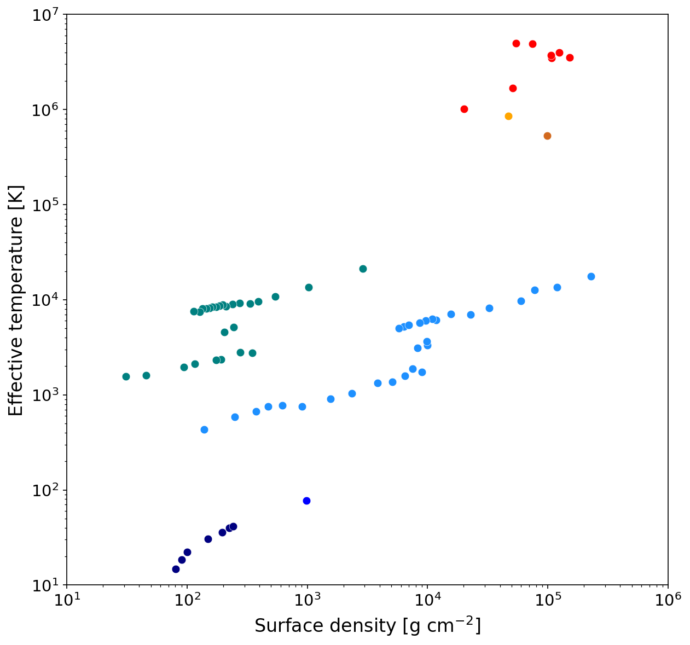

# RMHD_TEs

Thermal Equilibrium states from Radiation MagnetoHydroDynamics simulations of accretion flows at different angular velocities.

## Results

<table>
<tr>
<td align="center">
<a href="outputs/RMHD_TEs.pdf">

</a>
<br>
<b>Thermal Equilibrium Curves</b><br>
Surface density vs Effective temperature
</td>
<td align="center">
<a href="outputs/RMHD_alphas.pdf">

</a>
<br>
<b>Alpha Parameter Plot</b><br>
Pressure vs Stress (viscosity analysis)
</td>
</tr>
</table>


## Overview

This repository compiles results from radiation MHD simulations using the ZEUS code with shearing box approximation. The main script `RMHD_TEs.py` plots the thermal equilibrium states of accretion flows, showing the relationship between surface density (Σ) and effective temperature (T_eff) for different angular velocities (Ω).

## Features

- Compiles multiple simulation results listed in `target_config.py`
- Generates two types of plots:
  - **TE curves**: Surface density vs. Effective temperature
  - **Alpha plot**: Pressure vs. Stress (for viscosity parameter analysis)
- Color-coded by angular velocity Ω for easy comparison
- Supports both special cases (hardcoded values) and full simulation data

## Requirements

### Python Dependencies

```bash
pip3 install numpy matplotlib
```

- Python 3.7+
- numpy
- matplotlib

### Required Python Files

| File | Description |
|------|-------------|
| `RMHD_TEs.py` | Main script for generating thermal equilibrium curves |
| `target_config.py` | Configuration file listing all simulation targets and their parameters |
| `zeus_param.py` | Reads ZEUS simulation parameters from configuration files |
| `readu.py` | Binary data reader for ZEUS output files |

## Simulation Data Structure

The repository includes simulation data in the `data/` directory. Each simulation target (e.g., `ws0433`) has the following file structure:

```
data/
└── {target_name}/
    ├── h/
    │   ├── resolv.data     # Dimension info (n_t, n_vave) [text]
    │   └── vave.data       # Volume-averaged history data [binary]
    ├── init/               # Parameter files (at least one required)
    │   ├── iparax.data     # Contains omega, h0 [text]
    │   ├── normalize.data  # Alternative parameter file [text]
    │   └── ipara.data      # Alternative parameter file [text]
    ├── src/
    │   └── Makefile        # Determines problem type (isothermal/radiation)
    └── z3dinput            # Simulation input parameters [text]
```

### Data Directory Contents

The `data/` directory contains preprocessed simulation data from various ZEUS radiation MHD runs. See [target_config.py](target_config.py) and [Target Configuration and References](#target-configuration-and-references) for details.

### File Formats

#### `h/resolv.data`
Text file containing:
```
n_t n_vave
```
- `n_t`: Number of time steps
- `n_vave`: Number of variables

#### `h/vave.data`
Binary file (big-endian, float32) with shape `[n_t, n_vave]` containing:
- Column 3: Density (for Σ calculation)
- Column 4: Energy density (for gas pressure)
- Column 11: Radiation energy density
- Columns 12-13: Shear stress components
- Column 81: Gas pressure (for h2014/h2015/h2016 series)
- Columns 88-89: Maxwell/Reynolds stress (h2016 series)
- Column 79: Self-gravity term (h2016 series)

#### `init/iparax.data` (or alternatives)
Text file containing:
```
omega h0
```
- `omega`: Angular frequency Ω
- `h0`: Scale height

#### `z3dinput`
Text file with simulation parameters including:
- `gascon` line: gamma (column 8), mean molecular weight (column 4)
- `ggen1/2/3` lines: Box dimensions in x, y, z directions

## Usage

1. Ensure simulation data is properly organized in the directory structure above
2. Configure targets in `target_config.py`
3. Run the main script:

```bash
python3 RMHD_TEs.py
```

Optional legend toggle:

```bash
# Hide legends
python3 RMHD_TEs.py --legend off

# Show legends (default)
python3 RMHD_TEs.py --legend on
```

Output plots will be saved to:
- `outputs/RMHD_TEs.pdf` - Thermal equilibrium curves plot
- `outputs/RMHD_alphas.pdf` - Alpha parameter plot
- `outputs/RMHD_TEs.png` - PNG version for web display
- `outputs/RMHD_alphas.png` - PNG version for web display

## Target Configuration and References

Simulations are grouped by series in `target_config.py`:
- **h2006 series**: Gas-dominated flow around a black hole (https://doi.org/10.1086/519515)
- **h2007 series**: Gas-radiation-comparable flow around a black hole (https://doi.org/10.1086/519515)
- **h2009 series**: Radiation-dominated flow around a black hole (https://doi.org/10.1088/0004-637X/691/1/16)
- **h2011 series**: Outer accretion flow with a dead zone around a young star (https://doi.org/10.1088/2041-8205/732/2/L30)
- **h2014 series**: Accretion flow around a white dwarf (https://doi.org/10.1088/0004-637X/787/1/1)
- **h2015 series**: Inner accretion flow around a young star (https://doi.org/10.1093/mnras/stv203)
- **h2016 series**: Self-gravitating accretion flow around a young star (https://doi.org/10.1093/mnras/stx824)

Each target specifies:
- `name`: Simulation identifier
- `ave`: Time averaging window [start, end] in orbital periods
- `path`: Data volume location
- `color_key`: Color coding by Ω value

## Physical Background

The thermal equilibrium curves represent steady-state solutions of accretion flows where:
- Heating (viscous dissipation) balances cooling (radiative losses)
- Each point represents a converged simulation at fixed (Ω, Σ)
- The S-shaped curves indicate thermal instability regions
- Different colors represent different rotation rates (Ω)

## Output Description

### TE Curves Plot
- **X-axis**: Surface density Σ [g cm⁻²]
- **Y-axis**: Effective temperature T_eff [K]
- **Colors**: Different angular velocities Ω
- Shows thermal equilibrium states and potential instability regions

### Alpha Plot
- **X-axis**: Pressure [dyn cm⁻²]
- **Y-axis**: Stress [dyn cm⁻²]
- **Reference lines**: α = 0.1, 0.01, 0.001
- Used to analyze the effective viscosity parameter

## Citation
If you use this code or data in your research, please cite:

```bibtex
@software{rmhd_tes,
  author = {Shigenobu Hirose},
  title = {RMHD_TEs: Thermal Equilibrium states from Radiation MHD simulations},
  year = {2024},
  url = {https://github.com/nombac/RMHD_TEs}
}
```

## Authors
Shigenobu Hirose (shirose@jamstec.go.jp)
